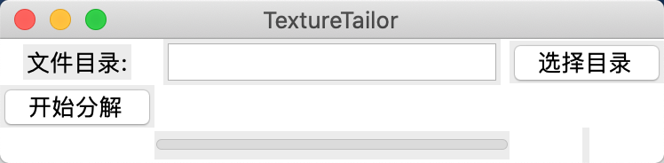
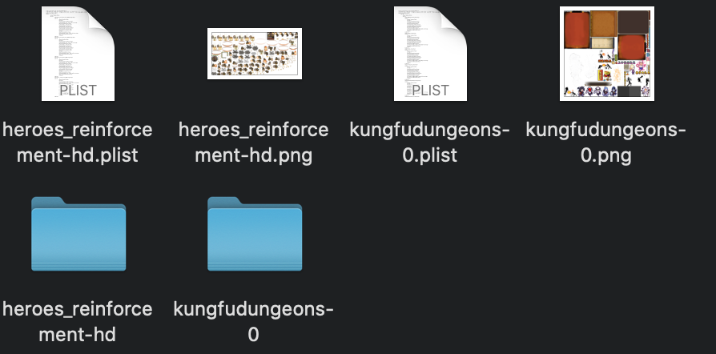
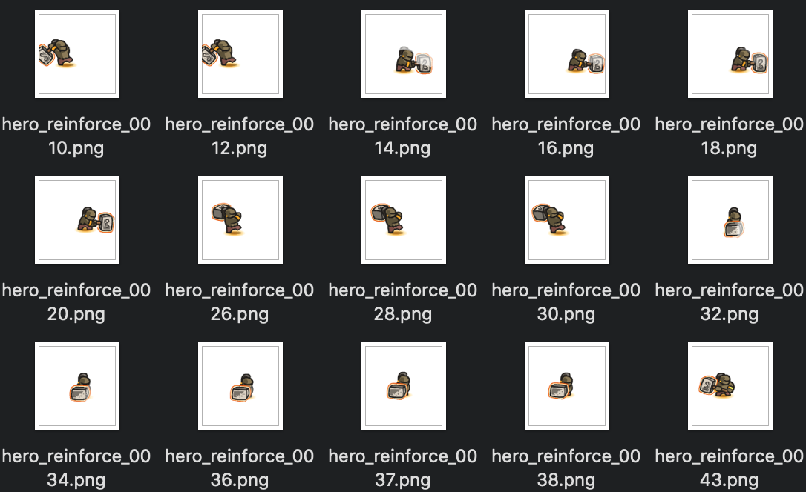

# TextureTailor

游戏图片纹理裁剪碎图工具，根据Plist配置文件拆分成子图。

- 由Python实现，开源可修改
- 支持主流plist和png纹理文件裁剪，支持format2和3(可查看plist文件中metadata字典中的format关键词)
- 支持目录内批量处理，导出为当前工作区的同名文件夹

**遇到操作问题或bug请issue作者，欢迎给个小⭐️⭐️**

## 预览

## 使用说明

- Mac App：下载TextureTailor.dmg运行
- 命令行：配置Python环境，使用`pip install -r requirements.txt`安装依赖库，执行`python3 TextureTailor.py`

**Tips:** Mac App启动时有延迟，等待几秒后才能打开

## ipa拆包游戏资源png无法裁剪问题：

原因是因为苹果打包成ipa时，会使用Python的pngcrush库对png图片进行压缩优化，故图片文件头无法解析

需要执行撤销优化的指令，具体操作请移步作者简书：[TextureTailor自制Plist碎图工具](https://www.jianshu.com/p/c486357f44ad)

## 实现逻辑

- 选择目录中包含同名的plist和png文件加入执行队列(暂不支持多级目录)
- 导出目录不存在自动生成
- 依赖metadata中format关键词判断plist格式

## 格式解释

### 裁剪必要参数

1. 父图的切割区域
2. 子图原始尺寸(帧动画包含位移，故原始尺寸要比渲染尺寸大)
3. 偏移量(渲染尺寸偏移)
4. 旋转

### Format 2

\- frames

​    name.png

​        frame

​        sourceSize

​        sourceColorRect

​        offset

​        rotated

\- metadata

​    format : 2

### Format 3

\- frames

​    name.png

​        textureRect : 父图切割区域 

​        spriteSourceSize : 子图原始尺寸

​        spriteColorRect ： 子图渲染原点和尺寸

​        spriteTrimmed ： 子图渲染原点是否偏移

​        spriteOffset ： 渲染原点偏移量 

​        textureRotated ： 图片是否旋转

​        spriteSize

​        aliases[]

\- metadata

​    format : 3

### 后续功能

- [ ] Window App
- [ ] 容错判断
- [ ] 多级目录检索
- [ ] 执行日志
- [ ] json / fnt位图字体 / spine的atlas 拆分

### 参考

Python初应用，开发过程中多有借鉴，鸣谢大佬：

[[PlistDumper](https://github.com/qcdong2016/PlistDumper)](https://github.com/qcdong2016/PlistDumper)

[[tp-png-split](https://github.com/ShawnZhang2015/tp-png-split)](https://github.com/ShawnZhang2015/tp-png-split)

